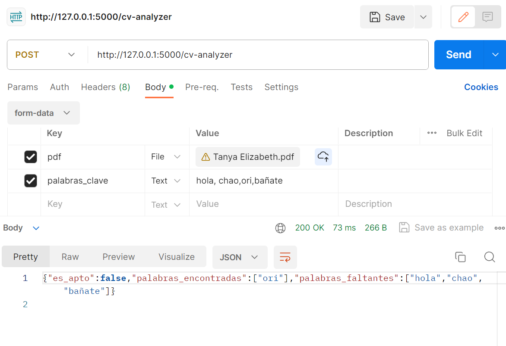

El proposito de este proyecto es comprobar si una persona es apta o no apta para un puesto de trabajo, comparando un archivo que contenga su curriculum con palabras claves, para ello utilizo python y una api para que el usuario pueda subir los archivos y compruebe si es apto.

# Instalar
pip install -r requirements.txt

# Usar
python main.py

# Ejemplo para usar

Se espera un archivo llamado pdf y un texto llamado palabras clave. Separadas por ,
Ejemplo: Hola, Data, experiencia en datos, 2022